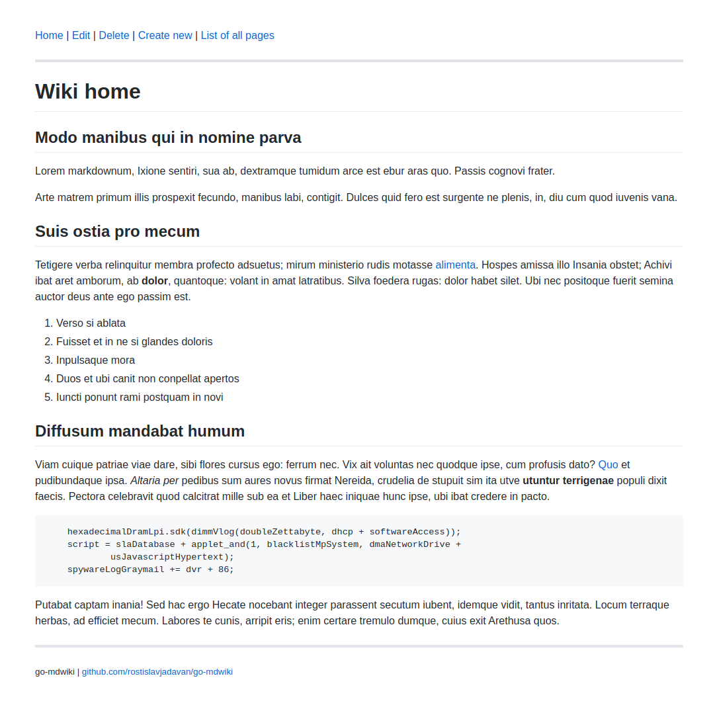
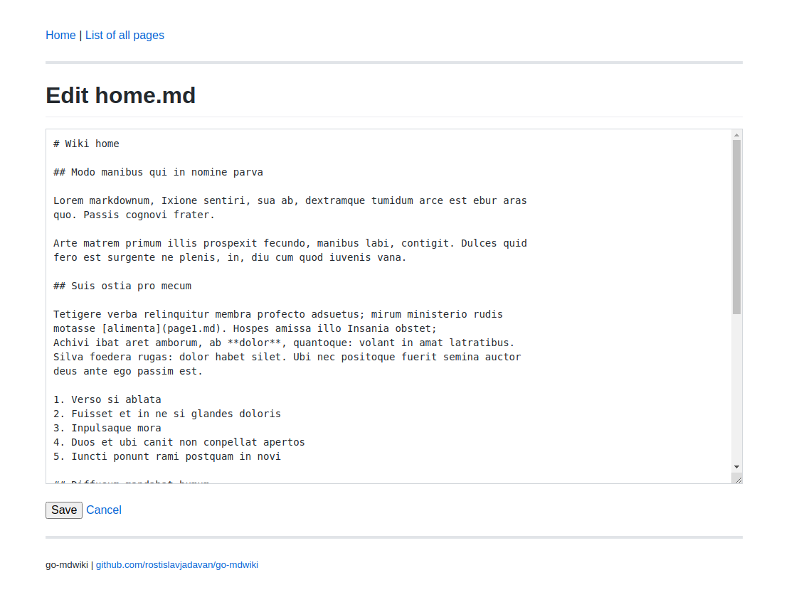

# mdwiki

## Basic Golang Markdown Wiki

- super simple 😊
- one binary + config file
- no user accounts
- pages are stored as plain markdown files
- github theme (thanks to https://github.com/sindresorhus/github-markdown-css)
- Echo used as underlying http framework (https://echo.labstack.com/)  
- using golang 1.16 (because of embed feature)
- inspired by go-bwiki

## How to run

```
go run .
```

## Configuration
Application loads `config.yml` on start up.

```
host: localhost
port: 8080
storage: .storage
```

- `host` & `port` - web server configuration
- `storage` is directory where pages going to be stored

## Screenshots

#### Page


#### Editor



## Logo

Made using https://excalidraw.com

