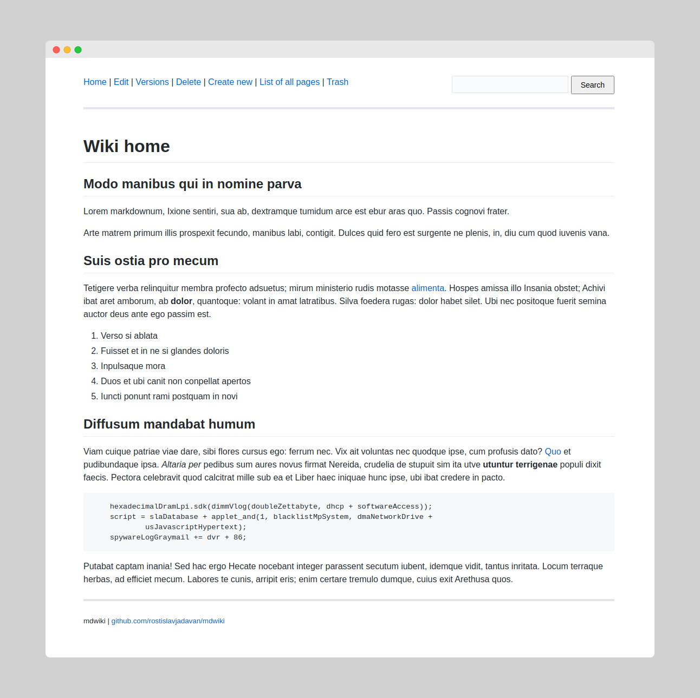
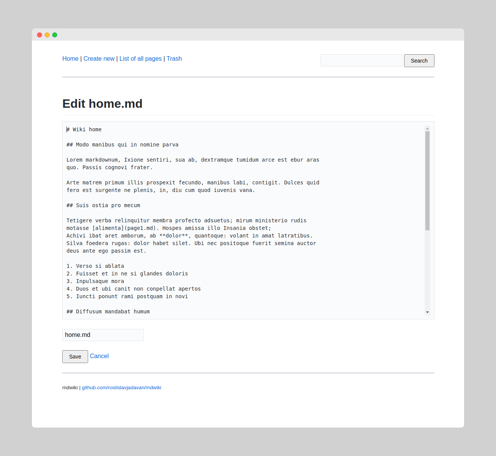
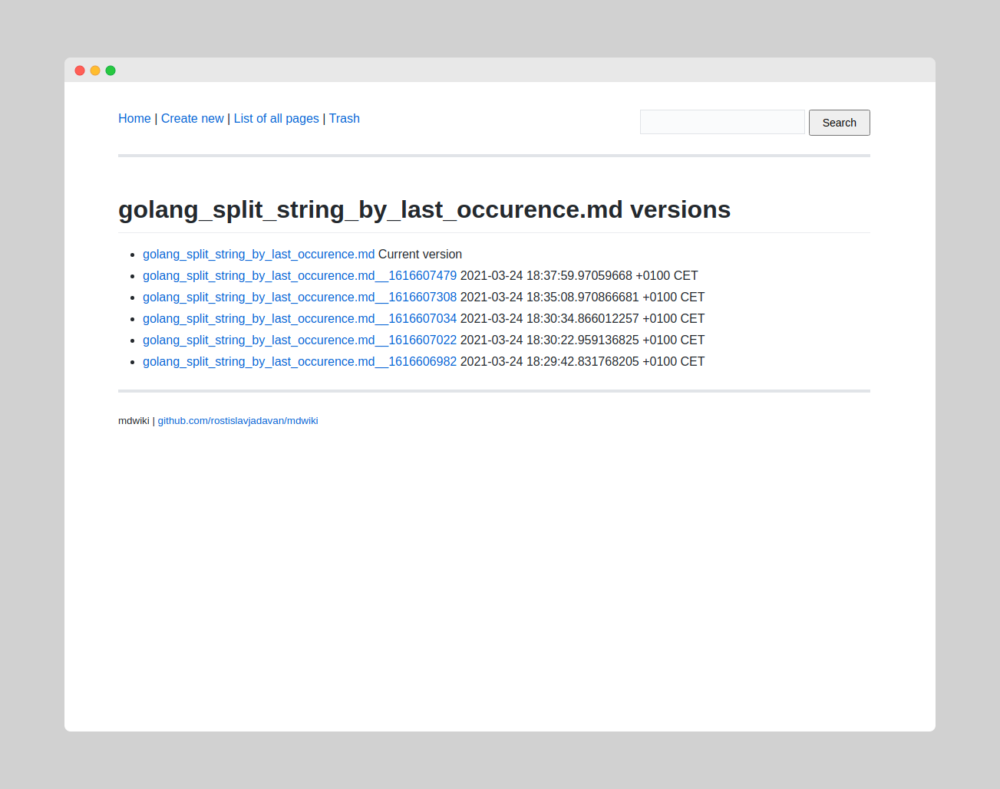
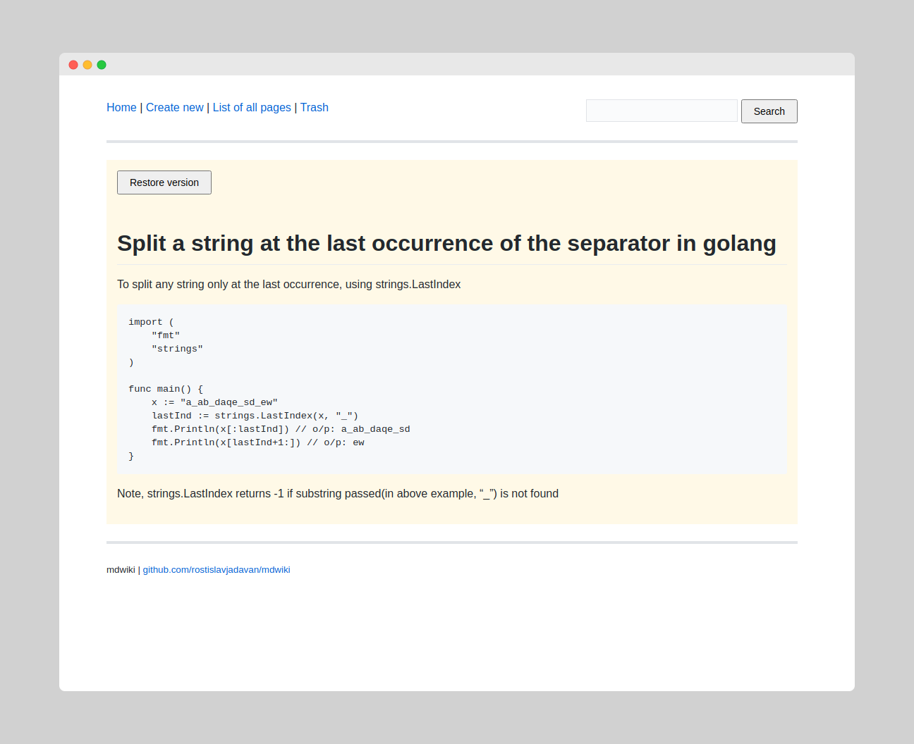
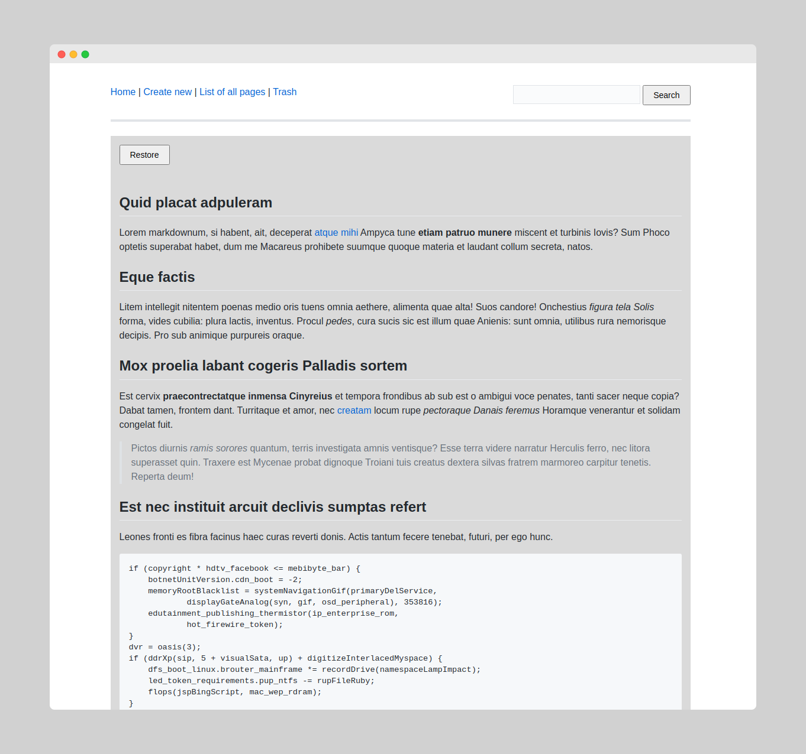

# mdwiki

## Golang Markdown Wiki

- super simple 😊
- one binary + config file
- no user accounts
- pages are stored as plain markdown files
- page versioning 
- github theme (thanks to https://github.com/sindresorhus/github-markdown-css)
- Echo used as underlying http framework (https://echo.labstack.com/)  
- using golang 1.16 (because of embed feature)
- inspired by go-bwiki

## Screenshots

#### Homepage


#### Editor


#### Page versions
Every update will create new version of the page. 



You can then view and restore any version you want.



#### Delete page
Deleted pages are moved to the trash. You can view them or restore them if you need.



_screenshots made using:_ https://www.screely.com

## How to build

```
go build .
```

## Configuration
Application loads `config.yml` on start up.

```
host: localhost
port: 8080
storage: .storage
```

- `host` & `port` - web server configuration
- `storage` is directory where pages going to be stored

## Running as `systemd` service

See [README.md](service/README.md) in  `/service` for information.  

## Logo

Made using https://excalidraw.com

